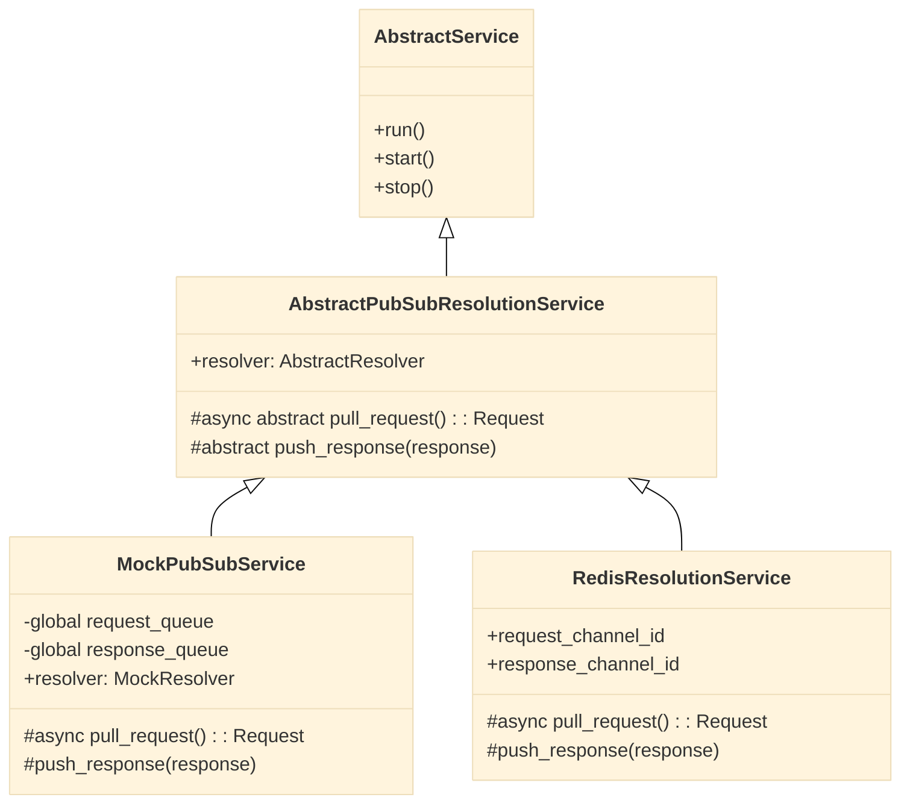
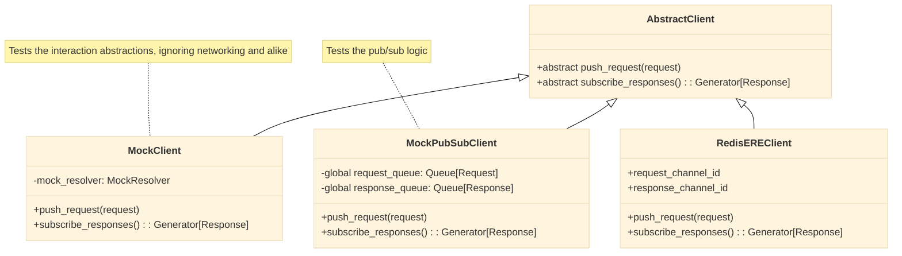
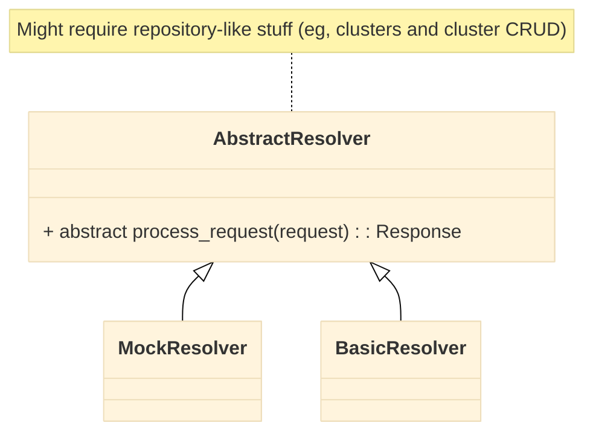

# Software Breadboards (Shape Up Methodology)

This document presents the main "software breadboards" for the Entity Resolution Engine (ERE) system, following the Shape Up methodology. The diagrams use [Mermaid](https://mermaid-js.github.io/mermaid/#/).

## Services

## Service Clients

## Resolvers

