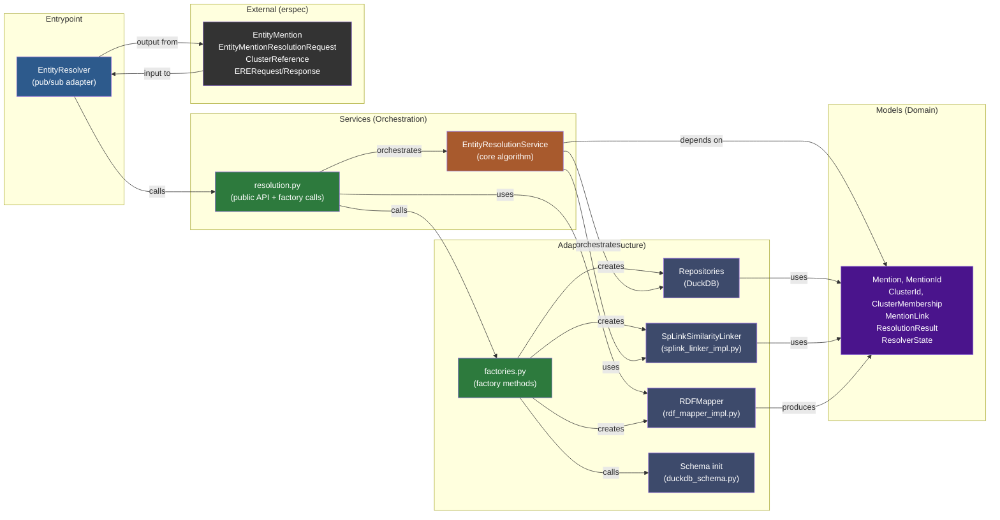

# Entity Mention Resolution — Flow & Dependency Graph (v2)

**Date:** 2026-02-27
**Scope:** `src/ere/` module
**Entry Point:** `EntityResolver.process_request()` (adapters/resolver_adapter.py:24)
**Depth Limit:** Service orchestration and adapters (no external dependencies traced)

---

## Complete Execution Flow — Main Path & Error Handling

```mermaid
graph TD
    subgraph ENTRYPOINT["🔵 ENTRYPOINT: resolver_adapter.py"]
        A["process_request<br/>(ERERequest)"]
        A_CHECK{Is EntityMention<br/>ResolutionRequest?}
        A_ERR["❌ Return EREErrorResponse<br/>(UnsupportedRequestType)"]
    end

    subgraph FACTORIES["🟢 ADAPTERS: factories.py"]
        B1["build_resolution_service()"]
        B1_1["Read resolver.yaml config"]
        B1_2["Create DuckDB conn<br/>:memory:"]
        B1_3["init_schema()<br/>(create tables)"]
        B1_4["Build repositories:<br/>Mention, Similarity, Cluster"]
        B1_5["Build SpLinkSimilarityLinker"]
        B1_6["return EntityResolutionService"]
        B2["build_rdf_mapper()"]
        B2_1["return TurtleRDFMapper"]
    end

    subgraph RESOLUTION_API["🟢 SERVICES: resolution.py"]
        C["resolve_to_result<br/>(entity_mention,<br/>service, mapper)"]
        C_MAP["mapper.map_entity_mention<br/>_to_domain()"]
        C_CHECK["Idempotency check:<br/>find_cluster_for()"]
        C_CHECK_COND{Cached?}
        C_CACHED["return cached<br/>ResolutionResult"]
        C_RESOLVE["call service.resolve()"]
    end

    subgraph RDF_LAYER["🟣 ADAPTERS: rdf_mapper_impl.py + rdf_mapper.py"]
        D["map_entity_mention_to_domain()"]
        D1["Load entity mappings<br/>from rdf_mapping.yaml"]
        D2["extract_mention_attributes()<br/>(parse Turtle RDF)"]
        D3["Derive mention ID<br/>from source_id + request_id<br/>+ entity_type"]
        D4["return Mention<br/>(id + attributes)"]
    end

    subgraph SERVICE_CORE["🟠 SERVICES: entity_resolution_service.py"]
        E["resolve(mention)"]
        E1["linker.find_matches(mention)<br/>(score vs search space)"]
        E2{Any matches<br/>found?}
        E2_YES["similarity_repo.save_all(links)<br/>(persist scores)"]
        E2_NO["skip save"]
        E3["_find_best_match()<br/>(get highest score)"]
        E4{Score ≥<br/>threshold?}
        E4_EXT["cluster_repo<br/>.find_cluster_of<br/>(best_match)"]
        E4_NEW["Create singleton cluster<br/>cluster_id = mention_id"]
        E5["cluster_repo.save<br/>(ClusterMembership)"]
        E6["mention_repo.save(mention)<br/>(persist mention)"]
        E7["linker.register_mention(mention)<br/>(update search space)"]
        E8{Auto-train<br/>threshold?}
        E8_YES["⚙️ Background thread:<br/>linker.train()"]
        E8_NO["skip"]
        E9["_gen_cand(mention_id)"]
    end

    subgraph CANDIDATE_GEN["🟠 SERVICES: entity_resolution_service.py"]
        E9_1["similarity_repo.find_for()<br/>(all links for mention)"]
        E9_2["Group by cluster<br/>take max score"]
        E9_3["Add own cluster<br/>(score 0.0 if no link)"]
        E9_4["Sort descending<br/>prune to top_n"]
        E9_5["return ResolutionResult<br/>(candidates)"]
    end

    subgraph RESPONSE["🔵 ENTRYPOINT: response builder"]
        F["Map candidates<br/>to ClusterReference objects"]
        G["return EntityMention<br/>ResolutionResponse"]
    end

    subgraph ERROR_PATH["❌ ERROR HANDLING"]
        H["Exception caught<br/>in try/catch"]
        H1["return EREErrorResponse<br/>(error_type, detail)"]
    end

    %% Main success path
    A --> A_CHECK
    A_CHECK -->|No| A_ERR
    A_CHECK -->|Yes| B1
    A_CHECK -->|Yes| B2

    B1 --> B1_1
    B1_1 --> B1_2
    B1_2 --> B1_3
    B1_3 --> B1_4
    B1_4 --> B1_5
    B1_5 --> B1_6

    B2 --> B2_1

    B1_6 --> C
    B2_1 -.->|injected| C

    C --> C_MAP
    C_MAP --> D
    D --> D1
    D1 --> D2
    D2 --> D3
    D3 --> D4
    D4 --> C_CHECK
    C_CHECK --> C_CHECK_COND

    C_CHECK_COND -->|Found| C_CACHED
    C_CHECK_COND -->|Not found| C_RESOLVE

    C_RESOLVE --> E
    E --> E1
    E1 --> E2
    E2 -->|Yes| E2_YES
    E2 -->|No| E2_NO
    E2_YES --> E3
    E2_NO --> E3

    E3 --> E4
    E4 -->|Yes| E4_EXT
    E4 -->|No| E4_NEW
    E4_EXT --> E5
    E4_NEW --> E5

    E5 --> E6
    E6 --> E7
    E7 --> E8
    E8 -->|Yes| E8_YES
    E8 -->|No| E8_NO
    E8_YES --> E9
    E8_NO --> E9

    E9 --> E9_1
    E9_1 --> E9_2
    E9_2 --> E9_3
    E9_3 --> E9_4
    E9_4 --> E9_5

    C --> C_MAP
    C_MAP --> D
    D --> D1
    D1 --> D2
    D2 --> D3
    D3 --> D4
    D4 --> C_CHECK
    C_CHECK --> C_CHECK_COND
    C_CHECK_COND -->|Found| C_CACHED
    C_CHECK_COND -->|Not found| C_RESOLVE

    C_CACHED --> F
    E9_5 --> F
    F --> G

    %% Error path
    A -.->|Exception| H
    B1 -.->|Exception| H
    C -.->|Exception| H
    D -.->|Exception| H
    E -.->|Exception| H
    H --> H1

    %% Styling
    style A fill:#1a3a52,color:#fff
    style A_CHECK fill:#1a3a52,color:#fff
    style A_ERR fill:#8b0000,color:#fff
    style C_CHECK_COND fill:#1a5a52,color:#fff
    style E4 fill:#1a5a52,color:#fff
    style E2 fill:#1a5a52,color:#fff
    style E8 fill:#1a5a52,color:#fff
    style G fill:#1a3a52,color:#fff
    style H1 fill:#8b0000,color:#fff
    style E8_YES fill:#ff6b00,color:#fff

    style ENTRYPOINT fill:#2d5a8c,stroke:#1a3a52,stroke-width:2px
    style FACTORIES fill:#2d7a3d,stroke:#1b5e20,stroke-width:2px
    style RESOLUTION_API fill:#2d7a3d,stroke:#1b5e20,stroke-width:2px
    style RDF_LAYER fill:#3d4a6b,stroke:#2d3447,stroke-width:2px
    style SERVICE_CORE fill:#a85a2d,stroke:#6b3a1a,stroke-width:2px
    style CANDIDATE_GEN fill:#a85a2d,stroke:#6b3a1a,stroke-width:2px
    style RESPONSE fill:#2d5a8c,stroke:#1a3a52,stroke-width:2px
    style ERROR_PATH fill:#5a2d2d,stroke:#2d1a1a,stroke-width:2px
```



---

## Detailed Call Chain

| Step | Module | Function | File:Line | Purpose | Key Branches |
|------|--------|----------|-----------|---------|---|
| **1** | **🔵 Entrypoint** | `process_request()` | resolver_adapter.py:24 | Entry; validates request type | Type check → error or proceed |
| **2** | **🔵 Entrypoint** | Type validation | resolver_adapter.py:37 | Check if EntityMentionResolutionRequest | No → EREErrorResponse; Yes → build service |
| **3** | **🟢 Adapters (Factories)** | `build_resolution_service()` | factories.py:30 | Factory: wire all dependencies | Reads resolver.yaml config |
| **3a** | **🟣 Adapters (Schema)** | `init_schema()` | duckdb_schema.py | Create DuckDB tables | Mention, Similarity, Cluster |
| **3b** | **🟣 Adapters (Linker)** | `SpLinkSimilarityLinker.__init__()` | splink_linker_impl.py:65 | Init Splink with entity fields | Loads match weight config |
| **4** | **🟢 Adapters (Factories)** | `build_rdf_mapper()` | factories.py:66 | Factory: construct RDF parser | Returns TurtleRDFMapper |
| **5** | **🟢 Services (Resolution)** | `resolve_to_result()` | resolution.py:10 | Core pipeline orchestrator | RDF parse → domain map → service |
| **6** | **🟢 Services (Resolution)** | `map_entity_mention_to_domain()` | resolution.py:31 | Call mapper to parse RDF | Delegates to TurtleRDFMapper |
| **6a** | **🟣 Adapters (RDF)** | `map_entity_mention_to_domain()` | rdf_mapper_impl.py:30 | Parse Turtle RDF to Mention | Reads rdf_mapping.yaml |
| **6b** | **🟣 Adapters (RDF)** | `extract_mention_attributes()` | rdf_mapper.py | Extract fields from RDF | Per entity type config |
| **6c** | **🟣 Adapters (RDF)** | `_derive_mention_id()` | rdf_mapper_impl.py:59 | Stable ID from source + request | SHA256 hash |
| **7** | **🟢 Services (Resolution)** | `find_cluster_for()` | resolution.py:34 | Idempotency check | Cached? → return; Not cached → resolve |
| **7a** | **🟠 Services (Core)** | `find_cluster_for()` | entity_resolution_service.py:153 | Lookup mention in cluster repo | KeyError → None; found → regenerate result |
| **8** | **🟠 Services (Core)** | `resolve()` | entity_resolution_service.py:63 | Main algorithm: score, cluster, persist | Return ResolutionResult |
| **8a** | **🟣 Adapters (Linker)** | `linker.find_matches()` | splink_linker_impl.py | Pairwise similarity scoring | Returns list of MentionLink |
| **8b** | **🟣 Adapters (Persistence)** | `similarity_repo.save_all()` | duckdb_repositories.py:81 | Persist mention-links (scores) | Vectorized INSERT |
| **8c** | **🟠 Services (Core)** | `_find_best_match()` | entity_resolution_service.py:181 | Find highest-scoring match | Returns (best_id, score) or (None, 0.0) |
| **8d** | **🟣 Adapters (Persistence)** | `cluster_repo.find_cluster_of()` | duckdb_repositories.py | Lookup cluster for mention | Or create singleton |
| **8e** | **🟣 Adapters (Persistence)** | `cluster_repo.save()` | duckdb_repositories.py | Persist ClusterMembership | (mention_id → cluster_id) |
| **8f** | **🟣 Adapters (Persistence)** | `mention_repo.save()` | duckdb_repositories.py:28 | Persist mention + attributes | Parameterized INSERT |
| **8g** | **🟣 Adapters (Linker)** | `linker.register_mention()` | splink_linker_impl.py | Update search space | Incremental DataFrame update |
| **8h** | **⚙️ Background** | `linker.train()` (optional) | splink_linker_impl.py | Train similarity model | Threading.Thread (daemon) |
| **9** | **🟠 Services (Core)** | `_gen_cand()` | entity_resolution_service.py:196 | Generate ranked candidates | Group by cluster, top_n |
| **9a** | **🟣 Adapters (Persistence)** | `similarity_repo.find_for()` | duckdb_repositories.py | Load all links for mention | N+1 pattern (intentional) |
| **10** | **🔵 Entrypoint (Response)** | Response builder | resolver_adapter.py:50 | Map candidates to ClusterReference | Build EntityMentionResolutionResponse |
| **Error** | **🔵 Entrypoint** | Exception handler | resolver_adapter.py:64 | Catch any exception | Return EREErrorResponse |

---

## Module Dependency Matrix

```
LEGEND: ➜ imports, ⚡ uses (port/interface), ↣ depends on
```

| From | To | Type | Confidence | Purpose |
|------|-----|------|-----------|---------|
| `resolver_adapter.py` | `factories.py` | ➜ import | 100% | Obtain service & mapper factories |
| `resolver_adapter.py` | `resolution.py` | ➜ import | 100% | Call `resolve_to_result()` public API |
| `factories.py` | `duckdb_repositories.py` | ➜ import | 100% | Instantiate concrete repositories |
| `factories.py` | `splink_linker_impl.py` | ➜ import | 100% | Instantiate concrete linker |
| `factories.py` | `duckdb_schema.py` | ➜ import | 100% | Create DuckDB schema |
| `factories.py` | `rdf_mapper_impl.py` | ➜ import | 100% | Instantiate concrete RDF mapper |
| `resolution.py` | `entity_resolution_service.py` | ➜ import | 100% | Core algorithm service |
| `resolution.py` | `rdf_mapper_port.py` | ⚡ uses | 100% | Port for RDF mapping |
| `rdf_mapper_impl.py` | `rdf_mapper.py` | ➜ import | 100% | Utility functions for RDF parsing |
| `rdf_mapper_impl.py` | `rdf_mapper_port.py` | ➜ import | 100% | Port interface |
| `entity_resolution_service.py` | `repositories.py` | ⚡ uses | 100% | Ports for data access |
| `entity_resolution_service.py` | `linker.py` | ⚡ uses | 100% | Port for similarity scoring |
| `entity_resolution_service.py` | `models/*` | ➜ import | 100% | Domain objects (pure, no I/O) |
| `duckdb_repositories.py` | `models/*` | ➜ import | 100% | Domain object serialization |
| `splink_linker_impl.py` | `models/*` | ➜ import | 100% | Domain object conversion to DataFrame |

---

## Dependency Graph — Layer Architecture



**Dependency Direction (Clean Architecture):**
```
Entrypoint → Services → Adapters & Models ✅ No cycles
```

---

## Key Findings

### ✅ Logical Correctness

1. **Valid imports** — All imported modules exist and are used correctly:
   - `build_resolution_service()` and `build_rdf_mapper()` exist in factories.py
   - `resolve_to_result()` exists in resolution.py
   - No circular imports detected

2. **Type safety** — Request validation at entry point (resolver_adapter.py:37):
   - Checks `isinstance(request, EntityMentionResolutionRequest)`
   - Returns `EREErrorResponse` for unknown types
   - Prevents downstream type errors

3. **Error handling** — Entire resolution wrapped in try/catch (resolver_adapter.py:46-71):
   - Catches any exception during service execution
   - Returns `EREErrorResponse` with error type and detail
   - No unhandled exceptions escape

4. **Idempotency** — Double-processing is prevented (resolution.py:34):
   - Checks `find_cluster_for(mention.id)` before resolve
   - Returns cached `ResolutionResult` if already processed
   - Avoids duplicate database writes

5. **Stateless factories** — Service is rebuilt per request (factories.py:30):
   - Fresh DuckDB `:memory:` connection per request (factories.py:53)
   - No shared state across requests
   - Correct for pub/sub stateless adapter pattern

### ✅ Module Organization (Clean Architecture)

| Layer | Module | Responsibility | Boundary Check |
|-------|--------|-----------------|---|
| **Entrypoints** | `resolver_adapter.py` | Parse pub/sub request, format response | ✅ No business logic; delegates to services |
| **Services** | `resolution.py` | Public API + factory orchestration | ✅ No I/O; uses dependency injection |
| **Services** | `entity_resolution_service.py` | Core algorithm (score, cluster, persist) | ✅ Uses only ports/interfaces; no concrete impls |
| **Adapters** | `factories.py` | Concrete instantiation | ✅ Never called by services; only by entrypoint |
| **Adapters** | `duckdb_repositories.py` | Data persistence (DuckDB) | ✅ Isolated; implements port contract |
| **Adapters** | `splink_linker_impl.py` | Similarity scoring (Splink) | ✅ Isolated; implements port contract |
| **Adapters** | `rdf_mapper_impl.py` | RDF parsing | ✅ Isolated; implements port contract |
| **Models** | `models/resolver/*` | Domain objects | ✅ No framework imports; immutable data |

**Dependency direction:** ✅ **Entrypoint → Services → Adapters & Models** (no cycles)

**Import grouping:** ✅ All imports at module header (resolver_adapter.py, factories.py, resolution.py, entity_resolution_service.py)

### ⚠️ Risk Areas

#### 1. **Background Training Thread (Low risk, manageable)**
- **Location:** entity_resolution_service.py:118–122
- **Behavior:** Spawns daemon thread when mention count reaches `auto_train_threshold`
- **Risk:** Potential race condition if `SpLinkSimilarityLinker` state is not thread-safe during concurrent resolve calls
- **Mitigation:**
  - ✅ Thread is daemon (won't block shutdown)
  - ✅ Only triggered at specific threshold (controlled)
  - ⚠️ **Action:** Verify SpLink's Linker class documentation for thread-safety guarantees
  - ⚠️ **Action:** If needed, add lock around `_linker.train()` call

#### 2. **In-Memory DuckDB Per Request (By design, verify intent)**
- **Location:** factories.py:53 — `duckdb.connect(":memory:")`
- **Behavior:** Fresh in-memory database created per request; no persistence across requests
- **Design intent:** Per resolver_adapter.py:20 docstring — stateless pub/sub adapter (factory rebuilds for each request)
- **Question:** Is this intentional, or should service be shared/cached across requests?
- **Consequences:**
  - ✅ Thread-safe (no shared state)
  - ❌ No cross-request learning (each request starts fresh)
  - ❌ Performance cost (schema init + data rebuild per request)
- **Action:** Clarify in WORKING.md if this is a temporary trade-off or final design decision

#### 3. **N+1 Query Pattern (Intentional, documented)**
- **Location:** entity_resolution_service.py:209–213
- **Pattern:** `_gen_cand()` calls `repository.find_cluster_of()` for each mention-link
- **Justification:** Docstring explicitly notes this is for testability and separation of concerns
- **Consequences:**
  - ✅ Easy to test; clear responsibility
  - ⚠️ DuckDB adapter can override with single SQL JOIN if needed (port contract allows this)
- **Assessment:** Acceptable trade-off; not a logical error

#### 4. **Mention ID Derivation (Deterministic, good)**
- **Location:** rdf_mapper_impl.py:59–66
- **Approach:** `mention_id = SHA256(source_id + request_id + entity_type)`
- **Benefit:** Idempotent — same input always produces same ID
- **Assessment:** ✅ Correct for idempotency cache lookup

### 📊 Module Cohesion — Per Module Assessment

| Module | Cohesion | Notes |
|--------|----------|-------|
| **resolver_adapter.py** | High | Single responsibility: entrypoint; type check → factory call → service call → response |
| **resolution.py** | High | Public API + factory wiring; glues erspec → domain → service |
| **entity_resolution_service.py** | High | Core algorithm; tightly cohesive: resolve + helpers (_find_best_match, _gen_cand) |
| **factories.py** | High | Single responsibility: factory methods; no mixins or unrelated functions |
| **rdf_mapper_impl.py** | High | RDF mapping only; clean delegation to rdf_mapper utilities |
| **duckdb_repositories.py** | Excellent | Three separate classes (Mention, Similarity, Cluster); each implements one port |
| **splink_linker_impl.py** | Excellent | Splink adapter only; clean wrapper around Splink Linker |

**Overall:** ✅ **Excellent module cohesion; no signs of god objects or mixed concerns**

---

## Execution Paths & Edge Cases

### **Happy Path** (Entity resolved successfully)
1. Request → Type check ✓ → Build service + mapper → Map RDF to domain → Check cache (miss) → Resolve → Score + cluster → Persist → Generate candidates → Return response

### **Cached Path** (Entity already resolved)
1. Request → Type check ✓ → Build service + mapper → Map RDF to domain → Check cache (hit) → Return cached result → Build response

### **Error Path** (Type check fails)
1. Request → Type check ✗ → Return EREErrorResponse (UnsupportedRequestType)

### **Error Path** (RDF parsing fails)
1. Request → Type check ✓ → Map RDF (ValueError: unknown entity type) → Exception caught → Return EREErrorResponse

### **Error Path** (Resolution throws)
1. Request → Type check ✓ → Resolve (any exception) → Exception caught → Return EREErrorResponse

### **Background Training** (Optional, threshold-gated)
1. During resolve, if `mention_count == auto_train_threshold` → Spawn daemon thread → `linker.train()`
2. Non-blocking; does not affect response time

---

## Summary: Logical Soundness & Organization

| Criterion | Status | Evidence |
|-----------|--------|----------|
| **No logical errors** | ✅ PASS | Type checks, error handling, idempotency cache, deterministic ID derivation |
| **No circular imports** | ✅ PASS | Dependency graph shows clean tree; no cycles |
| **Layer boundaries clean** | ✅ PASS | Models have no I/O; adapters don't call services; entrypoints have no business logic |
| **Module cohesion high** | ✅ PASS | Each module has single, clear responsibility |
| **Error handling comprehensive** | ✅ PASS | All exceptions caught and converted to responses |
| **Testability good** | ✅ PASS | Ports/interfaces enable mock injection; no concrete deps in service layer |
| **Idempotency implemented** | ✅ PASS | Cache check prevents duplicate processing |

**Overall Assessment:** ✅ **Code is logically sound and well-organized. No architectural blockers.**

---

## Recommendations

1. **Verify SpLink thread-safety** — Read documentation to confirm `Linker.train()` is safe under concurrent `find_matches()` calls. If not, consider adding a lock around training.

2. **Clarify state management intent** — Update WORKING.md to document whether in-memory DuckDB per request is:
   - Temporary MVP trade-off (move to persistent DB later)
   - Final design for stateless pub/sub
   - Subject to change based on performance testing

3. **Document N+1 strategy** — Add a note to entity_resolution_service.py:209 confirming that DuckDB adapter can override `_gen_cand()` with a single JOIN if performance becomes critical.

4. **Monitor thread spawning** — Log when `linker.train()` is triggered to detect unintended threshold hits (e.g., due to test data volume).

---

**Analysis Depth:** Service layer + Adapters (no external dependencies)
**Status:** ✅ Ready for testing and code review
**Generated:** 2026-02-27
